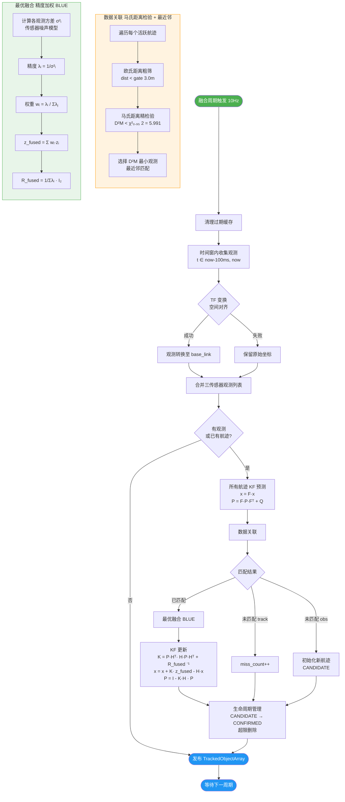

# 自适应多传感器融合算法综述

> **项目**: ADAS Fusion — 多传感器融合自动紧急避障系统  
> **文档版本**: v1.0 | **日期**: 2026-05-05

---

## 1. 问题描述

### 1.1 应用场景与核心任务

移动机器人在复杂室内/室外环境中自主行驶时，需实时感知周围障碍物（行人、车辆、静态障碍物等）并做出避障决策。单一传感器在可靠性、精度、感知维度上均存在固有局限：

| 传感器 | 优势 | 劣势 |
|--------|------|------|
| OAK-D PRO 深度相机 | 语义信息丰富（YOLO 检测分类），近距离深度精度较高 | 深度误差随距离指数增长，受光照/天气影响大，无法直接测速 |
| RPLIDAR A1 激光雷达 | 角度分辨率高，测距精度稳定，不受光照影响 | 无语义信息，远距离点云稀疏，无速度信息 |
| MS60-3015S80M4 毫米波雷达 | 直接测量径向速度，不受光照/天气影响，探测距离远 | 位置精度较低（约 0.2 m），角度分辨率有限，静态目标检测能力弱 |

**核心任务**：将上述三种异构传感器的异步观测实时融合，输出对周围多目标稳定、平滑、可靠的状态估计（位置 + 速度），为上层 TTC 避障决策提供可信的感知输入。

### 1.2 关键挑战与算法要求

自适应融合算法需解决以下五个相互关联的问题：

#### 挑战 1：多传感器时间异步

三种传感器的采样频率不同（相机 ~30 Hz、LiDAR ~10 Hz、雷达 ~20 Hz），且各传感器时间戳存在传输抖动。直接使用最新观测进行融合会导致时间基准不一致，产生虚假的位置偏移。

**要求**：设计时间同步机制，将异步观测对齐到统一的时间基准。该机制需满足：
- 在低速场景（$v \le 0.5 \ \text{m/s}$）下，同步误差产生的空间偏差远小于传感器测量噪声；
- 不引入额外的同步延迟，保证实时性。

→ **对应方案**：滑动时间窗（§5.1）

#### 挑战 2：多传感器空间坐标系不统一

各传感器安装在机器人的不同位置，各自拥有独立的坐标系（相机：`oak_rgb_camera_optical_frame`，LiDAR：`laser`，雷达：`radar_link`）。同一物理目标在不同传感器中的坐标表达不同。

**要求**：将所有传感器的观测统一变换到机器人本体参考坐标系 `base_link` 下。变换需考虑：
- 安装位置与姿态的静态外参；
- 观测噪声协方差在坐标变换下的传播。

→ **对应方案**：TF 空间对齐（§5.2）

#### 挑战 3：传感器可靠性随环境动态变化

不同环境下各传感器的可信度差异显著：
- **近距离（< 2 m）**：相机双目深度精度高，LiDAR 点云密集，均为可靠；
- **中距离（2~10 m）**：相机深度误差开始增大，LiDAR 点云变稀疏，雷达精度保持稳定；
- **远距离（> 10 m）**：相机深度几乎不可用，LiDAR 点云极为稀疏，雷达成为主要信息源；
- **动态目标**：雷达提供直接速度测量，优势明显；
- **低光照/雨雾**：相机性能严重下降甚至失效，LiDAR 与雷达仍可工作。

若采用固定权重融合，则上述环境自适应性丧失，融合结果由精度最差的传感器主导，整体性能显著退化。

**要求**：设计环境自适应的传感器噪声模型，使得：
- 传感器精度（方差的倒数）能随置信度、距离、速度等在线可观测因素动态调整；
- 当某传感器失效（如遮挡、超距）时，其方差自动趋于无穷，权重趋于零，自然退出融合；
- 融合权重在数学上严格保证最优（在线性无偏估计类中达到最小方差）。

→ **对应方案**：传感器噪声模型 + 精度加权 BLUE 最优融合（§5.5）

#### 挑战 4：多目标-多观测数据关联

每个融合周期可能同时存在多个跟踪目标（如行人 A、行人 B）和多个来自不同传感器的新观测。必须正确判断哪个观测属于哪个已存在的目标，哪些观测应初始化为新目标。

错误关联的后果：
- **漏关联**（观测未匹配到正确目标）→ 错误初始化新目标，轨迹碎片化；
- **误关联**（观测匹配到错误目标）→ 卡尔曼滤波更新引入错误信息，估计发散。

**要求**：设计统计上最优或近最优的关联决策规则，在给定虚警概率下最大化检测概率；同时需计算高效，满足实时性要求。

→ **对应方案**：马氏距离 $\chi^2$ 检验 + 最近邻匹配（§5.4）

#### 挑战 5：噪声环境下的连续状态估计

传感器观测均为含噪声的离散采样，且仅能观测位置（相机、LiDAR）或位置+速度（雷达）。需要从这些稀疏、含噪的观测中估计目标的连续运动状态（位置、速度），并提供估计不确定性的量化。

**要求**：状态估计器需满足：
- 在线递推，计算量小；
- 过程噪声模型准确反映目标的机动特性；
- 观测噪声协方差随融合质量自适应变化；
- 估计结果在线性高斯假设下达到最优。

→ **对应方案**：Kalman Filter（DWNA 模型）（§5.6）

### 1.3 问题-方案对应总览

```
挑战 1: 时间异步     ──→  滑动时间窗 (100ms)
挑战 2: 空间不统一   ──→  TF 坐标变换
挑战 3: 可靠性变化   ──→  传感器噪声模型 + 精度加权 BLUE 最优融合
挑战 4: 关联歧义     ──→  马氏距离 χ² 检验 + 最近邻匹配
挑战 5: 噪声估计     ──→  Kalman Filter (DWNA 离散白噪声加速度模型)
```

---

## 2. 算法框架设计

### 2.1 总体架构

融合算法部署于 `fusion_node`，以 10 Hz 的固定周期运行。每个周期内，算法按以下流水线顺序执行：

```
┌──────────────────────────────────────────────────────────────────────┐
│                      FusionNode::_fusion_cycle()                      │
│                                                                       │
│  ┌─────────┐   ┌─────────┐   ┌──────────┐   ┌──────────┐   ┌──────┐  │
│  │ 时间同步 │ → │ 空间对齐 │ → │ 数据关联  │ → │ 最优融合  │ → │ KF   │  │
│  │(滑动窗) │   │(TF变换) │   │(马氏检验) │   │(BLUE)    │   │更新  │  │
│  └─────────┘   └─────────┘   └──────────┘   └──────────┘   └──────┘  │
│                                                                       │
│  输入: 相机/激光/雷达观测缓存                                         │
│  输出: TrackedObjectArray (id, position, velocity, confidence)        │
└──────────────────────────────────────────────────────────────────────┘
```

### 2.2 模块功能说明

#### 模块 1：时间同步 — 滑动时间窗

维护三个传感器的观测缓存（`deque`, 最大长度 100）。在每个融合周期：

1. 清理过期数据：移除时间戳早于 `now - time_window - 1.0 s` 的观测；
2. 收集窗口内有效观测：选取满足 $t_{\text{now}} - \Delta t \le t_{\text{stamp}} \le t_{\text{now}}$ 的所有观测。

时间窗口 $\Delta t = 100 \ \text{ms}$，对应低速场景下最大 $5 \ \text{cm}$ 的空间偏差，远小于传感器测量噪声（最低约 $3 \ \text{cm}$），对融合精度影响可忽略。

#### 模块 2：空间对齐 — TF 坐标变换

对时间窗内收集的每个观测，查询其时间戳对应的 TF 变换 $(\mathbf{R}, \mathbf{t})$ 将观测位置从传感器坐标系变换至 `base_link`：

$$\mathbf{p}_{\text{base}} = \mathbf{R}_{\text{sensor}}^{\text{base}} \cdot \mathbf{p}_{\text{sensor}} + \mathbf{t}_{\text{sensor}}^{\text{base}}$$

若 TF 查询失败则保留原始坐标（退化处理）。

#### 模块 3：数据关联 — 马氏距离检验 + 最近邻

对每个已存在的跟踪目标（CANDIDATE 或 CONFIRMED 状态）：

1. **欧氏距离粗筛选**：观测与目标预测位置的距离须小于 `association_gate`（默认 3.0 m）；
2. **马氏距离精检验**：计算残差的马氏距离平方 $D_M^2$，与 $\chi^2_{0.95}(2) = 5.991$ 比较；
3. **最近邻匹配**：通过检验的候选中，选择 $D_M^2$ 最小的观测作为匹配结果。

未被任何目标匹配的观测用于初始化新目标。

#### 模块 4：最优融合 — 精度加权 BLUE

对匹配到同一目标的多个传感器观测：

1. 根据传感器噪声模型计算各观测的测量方差 $\sigma_i^2$；
2. 计算精度 $\lambda_i = 1/\sigma_i^2$；
3. 归一化权重 $w_i = \lambda_i / \sum_j \lambda_j$；
4. 融合位置 $\mathbf{z}_{\text{fused}} = \sum_i w_i \mathbf{z}_i$；
5. 融合协方差 $\mathbf{R}_{\text{fused}} = (1 / \sum_i \lambda_i) \cdot \mathbf{I}_2$。

该权重在线性无偏估计类中严格达到最小方差（Theorem 5.1），也是高斯假设下的最大似然估计（MLE）。

**传感器噪声模型**（方差 $\sigma_s^2$）：

| 传感器 | 噪声模型 | 关键因素 |
|--------|---------|---------|
| 视觉 | $\sigma_{\text{cam}}^2 = \frac{\sigma_{c0}^2}{\text{conf}} \exp\left(\frac{d^2}{2\sigma_c^2}\right)$ | 检测置信度 conf，径向距离 $d$ |
| LiDAR | $\sigma_{\text{lidar}}^2 = \sigma_{l0}^2 \frac{N_{\text{ref}}}{\|C\|}$ | 聚类点数 $\|C\|$ |
| 雷达 | $\sigma_{\text{radar}}^2 = \frac{\sigma_{r0}^2}{\text{conf} (1 + \alpha\|v_{\text{radial}}\|/v_0)}$ | 检测置信度 conf，径向速度 $v_{\text{radial}}$ |

#### 模块 5：Kalman Filter 跟踪

采用恒定速度（CV）模型，状态向量 $\mathbf{x} = [p_x, p_y, v_x, v_y]^\top$。

**过程噪声**：DWNA（Discrete White Noise Acceleration）模型，以 $q$ 为噪声强度系数。

**观测噪声**：使用模块 4 输出的自适应融合协方差 $\mathbf{R}_{\text{fused}}$，各帧随融合质量动态变化。

**生命周期管理**：

```
                 关联 ≥ 3 帧
  CANDIDATE ────────────────────→ CONFIRMED
      │                                │
      │ 丢失 ≥ 5 帧                     │ 丢失 ≥ 5 帧
      ↓                                ↓
   [DELETED]                       [DELETED]
```

### 2.3 核心数据结构

| 结构 | 字段 | 说明 |
|------|------|------|
| `Observation` | position, velocity, confidence, source, cluster_size, stamp, dist | 单个传感器观测（空间对齐后） |
| `Track` | id, x[4], P[4×4], F, H, Q, R_fused, class_id, confidence, source_flag, miss_count, hit_count, state | 单个跟踪目标，内嵌 KF 状态 |
| 缓存 | `_cam_cache`, `_lidar_cache`, `_radar_cache` (deque) | 各传感器时间窗观测缓存 |

---

## 3. 融合算法流程图



### 3.1 流程图关键节点说明

| 节点 | 对应算法章节 | 时间复杂度 |
|------|-------------|-----------|
| 时间窗收集 | §5.1 滑动时间窗 | $O(N_{\text{cache}})$ |
| TF 空间对齐 | §5.2 TF 坐标变换 | $O(N_{\text{obs}})$ |
| 数据关联 | §5.4 马氏距离检验 | $O(N_{\text{track}} \times N_{\text{obs}})$ |
| 最优融合 (BLUE) | §5.5 精度加权融合 | $O(N_{\text{matched}})$ |
| KF 预测/更新 | §5.6 Kalman Filter | $O(N_{\text{track}})$ |

---

## 4. 数学基础速查

### 4.1 核心公式

**马氏距离检验**：
$$D_M^2 = (\mathbf{z} - \mathbf{H}\mathbf{x}_{\text{pred}})^\top (\mathbf{H}\mathbf{P}_{\text{pred}}\mathbf{H}^\top + \sigma^2\mathbf{I}_2)^{-1} (\mathbf{z} - \mathbf{H}\mathbf{x}_{\text{pred}}) \sim \chi^2(2)$$

**最优融合权重**（Theorem 5.1）：
$$w_i = \frac{1/\sigma_i^2}{\sum_j 1/\sigma_j^2}, \quad \mathbf{z}_{\text{fused}} = \sum_i w_i \mathbf{z}_i, \quad \sigma_{\text{fused}}^2 = \frac{1}{\sum_i 1/\sigma_i^2}$$

**Kalman 更新**（Theorem 5.2）：
$$\mathbf{K} = \mathbf{P}_{\text{pred}}\mathbf{H}^\top (\mathbf{H}\mathbf{P}_{\text{pred}}\mathbf{H}^\top + \mathbf{R}_{\text{fused}})^{-1}$$
$$\mathbf{x}_{\text{new}} = \mathbf{x}_{\text{pred}} + \mathbf{K}(\mathbf{z}_{\text{fused}} - \mathbf{H}\mathbf{x}_{\text{pred}})$$
$$\mathbf{P}_{\text{new}} = (\mathbf{I} - \mathbf{K}\mathbf{H})\mathbf{P}_{\text{pred}}$$

### 4.2 最优性保证

在以下假设下，整个融合流水线（观测 → 关联 → 融合 → 滤波）为**全局最优**（最小方差无偏估计 MVUE / 最大后验估计 MAP）：

1. 过程噪声与观测噪声均为零均值高斯白噪声；
2. 数据关联正确（马氏距离门限检测在 Neyman–Pearson 意义下最优）；
3. 时间同步误差可忽略（低速场景下 $< 5 \ \text{cm}$）。

详细证明参见 `Algorithm.md` 的 Theorem 5.1 与 Theorem 5.2。

---

## 5. 与决策模块的接口

融合算法输出的 `TrackedObjectArray` 包含每个目标的：

- **稳定 ID**：跨帧唯一，支持多目标持续跟踪；
- **位置** $(p_x, p_y)$：BLUE 最优融合 + KF 平滑后的位置估计；
- **速度** $(v_x, v_y)$：KF 估计的速度分量；
- **综合置信度**：多传感器置信度的均值；
- **来源标志位**：指示该目标由哪些传感器观测到（bit0: 视觉, bit1: LiDAR, bit2: 雷达）。

决策节点（`decision_node`）基于这些输出计算 TTC（碰撞时间）并执行分级避障。融合的精度直接影响 TTC 计算的准确性：位置/速度的估计误差会导致 TTC 偏差，进而影响避障时机判断。这正是本算法采用严格最优融合框架的根本动因。

---

## 参考文献

- Anderson, B. D. O. & Moore, J. B. *Optimal Filtering*. Prentice-Hall, 1979.
- Bar-Shalom, Y., Li, X. R., & Kirubarajan, T. *Estimation with Applications to Tracking and Navigation*. Wiley, 2001.
- Blackman, S. & Popoli, R. *Design and Analysis of Modern Tracking Systems*. Artech House, 1999.
